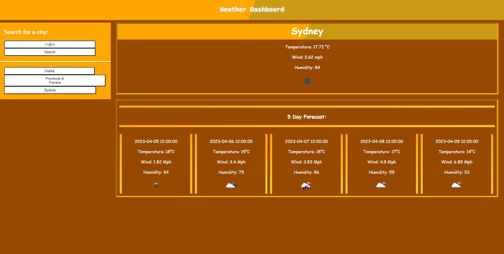

# Weather Dashboard

## Description

The Weather Dashboard project is a user-friendly web application that utilizes OpenWeatherMap to provide a 5-day weather forecast for the city of your choice.

### Key Features

Here are the key features and actions implemented in this project:

1. **HTML, CSS, and jQuery**: The project is built using HTML, CSS, and JavaScript with the jQuery library, ensuring a responsive and interactive user experience.

2. **API Integration**: The application fetches weather data and weather icons from OpenWeatherMap's API to provide up-to-date weather information.

3. **City Selection**: Interactive buttons allow users to easily select and view the weather forecasts for their previous cities.

### Explore the Weather Dashboard

To check the weather forecast for your chosen city, visit the deployed website:

[**Weather Dashboard Website**](https://purplelume.github.io/WeatherDashboard/)

Feel free to explore and stay informed about the weather in your favorite locations!